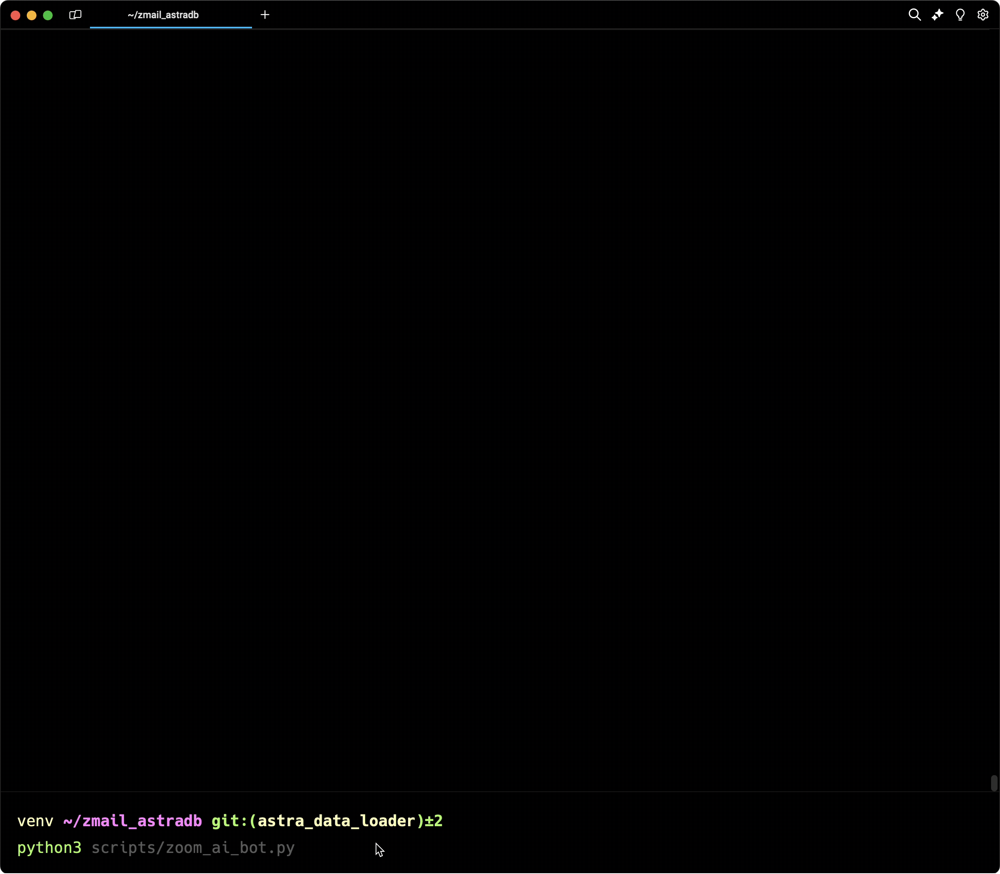

# 🤖 Zoom / Astra Meeting Summary Bot 🤖

An AI bot that uses [RAG (Retrieval Augmented Generation)](https://www.datastax.com/guides/what-is-retrieval-augmented-generation) to have intelligent conversations about user's Zoom meetings. 

#### Become a knowledgeable meeting 🧙‍♂️ wizard!

This project contains a set of Python scripts designed to interact with Zoom meetings and [Astra DB](https://www.datastax.com/products/datastax-astra), leveraging [OpenAI](https://platform.openai.com/docs/overview) for natural language processing. Below is a description of each script and instructions on how to install and run the project.

## 📜 Scripts

### `astra_db.py`

Handles interactions with Astra DB. It includes functions to connect to the database, perform CRUD operations, and manage data storage and retrieval.

### `load_data.py`

Responsible for loading data into Astra DB. It reads data from the Zoom API output, processes it, and inserts it into the database. It also includes functions to validate and clean the data before insertion.

### `zoom_ai_bot.py`

Implements a Zoom AI Bot that interacts with users via the terminal using [DataStax Langflow](https://www.langflow.org/). It uses OpenAI's API to process user input and generate responses. The bot leverages DataStax Astra DB as its vector store to retrieve relevant context for the LLM (Large Language Model) to process.

## 💻 Installation

1. **Clone the repository**:
    ```sh
    git clone https://github.com/ojusave/zmail_astradb.git
    cd zmail_astradb
    ```

2. **Create and activate a virtual environment**:
    ```sh
    python3 -m venv venv
    source venv/bin/activate # On Windows, use `venv\Scripts\activate`
    ```

3. **Install the required dependencies**:
    ```sh
    pip install -r requirements.txt
    ```

4. **Create a `.env` file**:
    - Copy the contents of `.env.example` into a new file named `.env`.
    - Fill in the required environment variables with your own values.

## 🚀 Running the Scripts

### 💾 Running `load_data.py`


To run the `load_data.py` script, use the following command:
```sh
python load_data.py
```

This script should be run first to ensure that there is data in the system.

### 🤖 Running `zoom_ai_bot.py`



To run the zoom_ai_bot.py script, use the following command:
```sh
python zoom_ai_bot.py
```
This script starts the Zoom AI Bot, which interacts with users via the terminal.

## 🌍 Environment Variables
The project requires several environment variables to be set. Below is an example of what your .env file should look like:

```sh
ASTRA_DB_DATABASE_ID=your_astra_db_id
ASTRA_DB_APPLICATION_TOKEN=your_astra_db_application_token
ASTRA_DB_API_ENDPOINT=your_astra_db_api_endpoint
OPENAI_API_KEY=your_openai_api_key
```